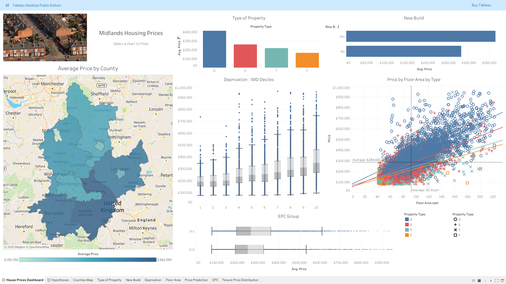
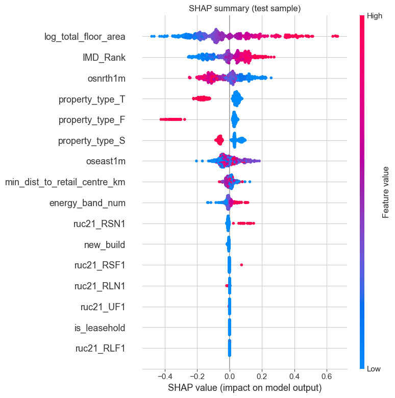

# West Midlands House Prices Analysis

## Overview
This project analyses residential property prices across the **West Midlands** region to uncover the key drivers of value and predict future prices using explainable machine-learning models.  
It combines open UK data sources — property transactions, energy efficiency, and socio-economic indicators — into a single analytical dataset and presents insights through an **interactive Tableau dashboard**.

This work forms the **Capstone Project** for the *Code Institute Data Analytics with Artificial Intelligence Bootcamp*.

---

## Business Requirements

### Problem Statement
Property valuation is complex and buyers, investors and estate agencies often lack transparency about how different factors affect price.  

This project aims to address the question:

*What are the most significant factors influencing house prices in the West Midlands, and can we build a transparent model to predict them?*

The clients are buyers and estate agencies. 

Business Requirement 1 - The clients need to understand the drivers of property prices in order to make more informed purchase decisions.

Business Requirement 2 - The clients is interested in using existing housing sold data and related property and location information to predict the selling price for a property.

### Business Goals & Success Criteria
This project aims to: 
1. **Identify** which features (property type, floor area, deprivation level, tenure, EPC band etc.) best explain price variation.  
2. **Develop** a machine-learning model to predict `price`.  
3. **Visualise** regional and feature-level patterns via a Tableau dashboard.  
4. **Communicate** actionable insights to the clients.

---

## Hypotheses

Hypothesis 1: The property type has an effect on the price: Detached houses have a higher price than semi-detached, which are higher than terraced, which are higher than flats. This will be validated using visualizations or statistical tests. 

Hypothesis 2: New builds sell at a premium compared to older properties. This will be validated using visualizations and statistical tests (t-test).

Hypothesis 3: A higher Index of Multiple Deprivation (IMD) decile is associated with a higher price. The expected relationship is a positive correlation. This will be validated using visualizations or statistical tests.

Hypothesis 4: Properties with EPC bands A to C have a price premium compared to bands D to G. The expected relationship is a positive effect. This will be validated using visualizations, ANOVA or regression.

Hypothesis 5: Leasehold properties sell at a discount compared to freehold properties. The expected relationship is a negative effect. This will be validated using visualizations, a t-test and regression analysis.

In summary:

| ID | Hypothesis | Expected Relationship | Validation |
|----|-------------|----------------------|-------------|
| H1 | Detached > Semi > Terraced > Flat in price  | Positive hierarchy | Viz, ANOVA, Tukey |
| H2 | New builds sell at a premium | Positive effect | Viz, t-test |
| H3 | Higher IMD decile → higher price | Positive correlation | Viz, Spearman rho, Regression |
| H4 | EPC A–C bands have premium vs D–G | Positive effect | Viz, ANOVA, Regression |
| H5 | Leasehold discount vs freehold | Negative effect | Viz, t-test, Regression |

---
## Methodology

We will test these hypotheses by merging publicly available datasets publicly available sources. They will then be validated using visualizations or statistical tests. An interactive Tableau dashboard will be created to support the insight .

In order to identify which features (property type, floor area, deprivation level, tenure, EPC band etc.) best explain price variation.

Machine-learning models will be developed to predict `price` using the property features.
ML pipelines will be built to create predictive models and then explain the relationships between the features and target. Models will be compared for their performance and whether they generalise. Cross Validation and hyperparameter optimisation will be used to tune the models.

## Exploratory Data Analysis, EDA 

When the datasets had been merged EDA was performed in Jupyter notebooks using the standard libraries  matplotlib, seaborn and plotly

## Dataset Content

### The analysis combines four open datasets joined on postcode, address and LSOA codes.

### 1 UK Land Registry — Price Paid Data (PPD)
- Residential sales across England & Wales 
- Key fields: `price`, `postcode`, `property_type`, `new_build`, `tenure`.  
- Purpose: target variable and core property attributes.  

The PPD documentation is provided at [Price Paid Dataset Price details](https://landregistry.data.gov.uk/app/doc/ppd/). 

Note that the transfer dates extend into 2024 because Land Registry includes sales completed late 2024 but registered by mid-2025; this is consistent with PPD release lag.

**License details**: Price Paid Data is released under the [Open Government Licence (OGL)](http://www.nationalarchives.gov.uk/doc/open-government-licence/version/3/).
  
📎 [Price Paid Data](https://www.gov.uk/government/statistical-data-sets/price-paid-data-downloads)

### 2️ ONS Postcode Directory (ONSPD)
- Maps postcodes to LSOA/MSOA/Local Authority.  
- Fields: `postcode`, `lsoa11cd`, `msoa11nm`, `ladnm`.  
- Purpose: spatial join between PPD, IMD and EPC.  
- PCD_OA_LSOA_MSOA_LAD_MAY22_UK_LU.CSV is a UK government geospatial dataset. It stands for Postcode Directory (PCD), Output Area (OA), Lower Layer Super Output Area (LSOA), Middle Layer Super Output Area (MSOA), Local Authority District (LAD), May 2022, UK, Lookup (LU). It's published by the Office for National Statistics (ONS) and used for mapping postcodes to statistical and administrative areas. The raw CSV file is over 400Mb in size so this will be zipped to upload to Github.
  
📎 [License details](https://www.ons.gov.uk/methodology/geography/licences)
  
📎 [ONS Postcode Directory](https://geoportal.statistics.gov.uk/)

### 3️ Indices of Multiple Deprivation (IMD 2019)
- Official UK deprivation scores at LSOA level.  
- Fields: `lsoa11cd`, `imd_score`, `imd_rank`, `imd_decile`.  
- Purpose: adds socio-economic context.  

**License details**: The IMD data are released under the [Open Government Licence (OGL)](http://www.nationalarchives.gov.uk/doc/open-government-licence/version/3/).
  
📎 [IMD 2019](https://www.gov.uk/government/statistics/english-indices-of-deprivation-2019)

### 4️ Energy Performance Certificates (EPC)
- Energy ratings and floor areas for individual properties.  
- Fields: `postcode`, `address`, `total_floor_area`, `current_energy_rating`.  The EPC data dictionary: 'EPC columns.CSV' 
- Purpose: floor area (for `price_per_sqm`) and energy rating feature.
  
📎 [License details](https://epc.opendatacommunities.org/docs/copyright)
  
📎 [EPC Open Data](https://epc.opendatacommunities.org/files/all-domestic-certificates.zip)
    
https://epc.opendatacommunities.org

## Ethics and privacy

All the data used in this project is publicly and openly available as described in detail in the datasets section above.

## Results

The [Tableau dashboard](https://public.tableau.com/views/UKMidlandsHousePrices/HousePricesDashboard?:language=en-GB&publish=yes&:sid=&:redirect=auth&:display_count=n&:origin=viz_share_link) was created from the merged datasets and used for EDA and visual insight.

# Hypotheses:

Hypothesis 1: The property type has an effect on the price per square metre: Detached houses have a higher price per square metre than semi-detached, which are higher than terraced, which are higher than flats. This will be validated using visualizations and statistical (ANOVA and Tukey) tests.

Multiple Comparison of Means - Tukey HSD, FWER=0.05       
=================================================================
group1 group2   meandiff   p-adj    lower        upper     reject
-----------------------------------------------------------------
     D      F -245845.0487   0.0 -258754.9343 -232935.1631   True
     D      S  -152475.847   0.0 -160459.2639 -144492.4301   True
     D      T -193417.0424   0.0 -202255.2329  -184578.852   True
     F      S   93369.2017   0.0   80873.5449  105864.8585   True
     F      T   52428.0063   0.0   39369.6716   65486.3409   True
     S      T  -40941.1954   0.0  -49162.5033  -32719.8876   True
-----------------------------------------------------------------
All pairwise comparisons are significant i.e. All property types have significantly different prices from each other. We therefore reject the null hypothesis for all group comparisons and conclude that there is a statistically significant difference between all property types.

Hypothesis 2: New builds sell at a premium compared to older properties. This will be validated using visualizations and statistical tests (t-test).
- Null hypothesis: There is no difference in prices between new builds and older properties
- Alternative hypothesis: There is a difference in prices between new builds and older properties

A T-test was used. We rejected the null hypothesis: There is a significant difference in prices.
T-test: t-statistic = 11.15, p-value = 0.00

Hypothesis 3: A higher Index of Multiple Deprivation (IMD) decile is associated with a higher price per square metre. The expected relationship is a positive correlation. This will be validated using visualizations, statistical tests (Spearman’s rho) or regression analysis.
- Null hypothesis: There is no correlation between IMD decile and price per square metre
- Alternative hypothesis: There is a correlation between IMD decile and price per square metre

The Spearman correlation was calculated from the trend as shown below. The null hypothesis was rejected. 

Hypothesis 4: Properties with EPC bands A to C have a price premium compared to bands D to G. The expected relationship is a positive effect. This will be validated using visualizations, ANOVA or regression.
- Null hypothesis: There is no difference in prices between EPC bands A to C and D to G
- Alternative hypothesis: There is a difference in prices between EPC bands A to C and D to G
  
The significance was less clear from a plot. So a T-test was used. 
The results T-test: t-statistic = 4.28, p-value = 0.00
Reject the null hypothesis: There is a significant difference in prices between EPC bands A-C and D-G.

# Machine Learning Models
1. Linear Regression used for an initial baseline model
- The R2 values are 0.70 respectively 0.74, which is good for a baseline model.
- The performance on the train and test set is similar, indicating that the model is not overfitting.
- It was noted in the plots of Prediction x Actual, the predictions tend to follow the actual value. 
- The residuals distribution is approximately normal, centered around zero, with slight skew and some outliers in both tails.

2. Random Forest Regressor model
- The R2 for train set is good 0.95 with a Mean Absolute Error £19,803. 
- However, for test set the R2 is far less, R2 0.71. The MAE for the test set is far larger at £52,389. 
- This may be a sign of overfitting. This is reinforced by the the actual vs predictions plots where we can see that the predictions are close to the actual prices for the train set compared to the test set.

3. Gradient Boosting Regressor model
Train R2 0.73, MAE £47,281
Test R2 0.74 MAE £49,354
Similar performance to training. - The results suggest good generalisation of the GradientBoostingRegressor model. Predictions align closely with actuals, indicating strong fit without severe overfitting.
The residuals distribution is approximately normal, centered around zero, and some outliers in both tails.

Cross Validation and Hyperparameter Optimisation of GradientBoostingRegressor model was then performed with no significant performance improvement.

4. AdaBoost Regressor model was tested which had a poorer performance.
Train Set R2 Score: 0.569
Test Set  R2 Score: 0.586

5. XGB Regressor model result
Train Set: R2 Score: 0.928
Test Set:  R2 Score: 0.773

The results show good performance of the XGBRegressor model.

Cross Validation and Hyperparameter Optimisation was then performed:
Train Set: R2 Score: 0.855
Test Set:  R2 Score: 0.786

These results show good performance and generalisation of the XGBRegressor model.
Of the models that generalise, this is the most performant.

We used SHAP (SHapley Additive exPlanations) to explain the model:

- The total floor area is dominant (model uses log_total_floor_area). High floor area red points sit at positive SHAP values so larger properties push predicted prices up. Low area blue points sit at negative values so smaller properties pull prices down.  
- IMD_Rank (IMD is the Index of Multiple Deprivation) matters next. Higher rank, less deprived, red pushes price up. Lower rank, more deprived, blue pushes price down.  
- osrnt1m (Northing from Ordnance Survey in meters) Blue dots (lower northing values = more southerly locations) push prices up. Red dots (higher northing values = more northerly locations) push prices down. It is likely that the rail connectivity to London is an underlying factor in that north-south price gradient. 
- Property types (S:Semi-detached, T:Terraced, F:Flat) vs the baseline category are impactful and mostly negative which means being that type lowers price relative to the detached baseline. The impact is ordered by type: Flat > Terraced > Semi-detached.
- oseast1m (Easting) shows a directional effect. Higher values shift predictions up suggesting location along the eastings axis associates with higher prices in this sample.  
- min_dist_to_retail_centre_km is mostly negative for high values red so being farther from retail pulls prices down while being closer blue raises them.  
- The energy efficiency rating, energy_band_num, has a positive effect for higher bands: better efficiency raises prices.  
- Rural urban classification ruc21_RSN1 (Rural town and fringe) area show clear effects. Red points show these settings, such as Solihull (a town in the country), tend to add value.

Size dominates price. Affluence and certain location features raise prices. Non‑detached types reduce price versus detached and the reduction amount is ordered by type: Flat > Terraced > Semi-detached. Energy efficient has a positive effect on prices.

## Future work

The model could be enhanced further by looking into journey times. 

For example, the rail connectivity to London is very likely a significant underlying factor in that north-south price gradient. 

The model could be enhanced by adding a feature like 'Rail time to London in minutes'.

HS2 Effect: Birmingham and Coventry will benefit massively from HS2, reducing journey times to ~45-52 minutes - this likely already factors into current prices.

## Roadmap and reflection
- What worked: 
Data integration: Joining PPD, EPC, ONSPD, IMD produced a rich, explainable dataset.
Target choice: Modelling log1p(price) stabilised variance and improved fit.
Model selection: XGBRegressor achieved the best out-of-sample MAE/R² while SHAP kept it interpretable; Ridge remains a transparent baseline.

- Challenges: Joining exact addresses across datasets required fuzzy matching.
Over/under at extremes: Linear baseline overvalued very small and undervalued very large homes.

- Limitations & risks: Market conditions change so the model needs to be retrained at intervals.
Coverage bias: Missing floor areas/EPCs can bias the dataset.

## Acknowledgements
Thanks to the team at Code Institute, and Vasi Pavaloi in particular for his support throughout the course.
A number of the Code Institute machine learning lesson code examples were used in the project development.

----